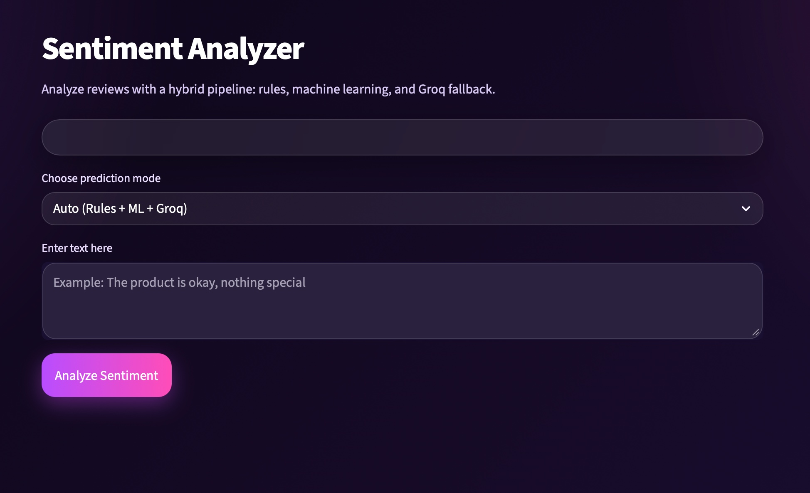
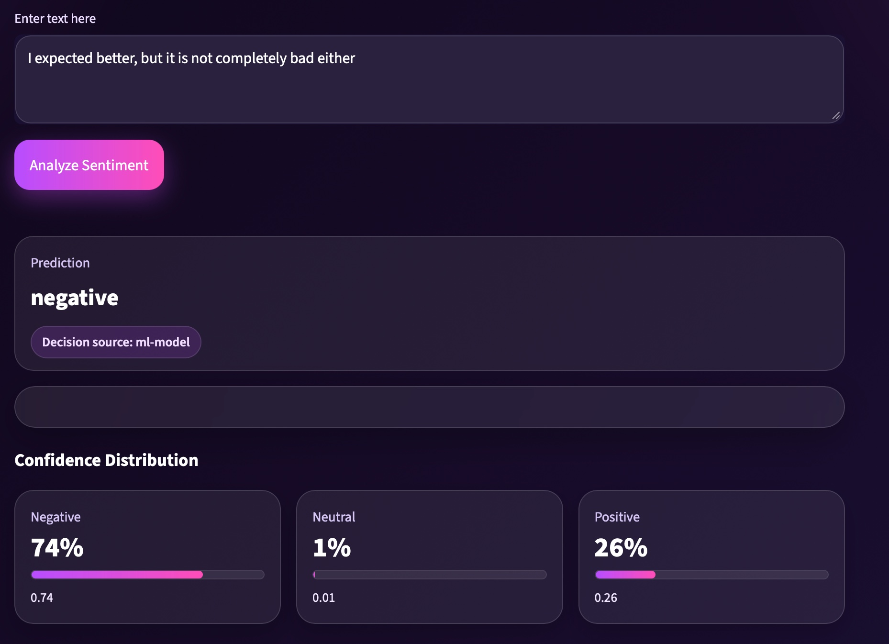
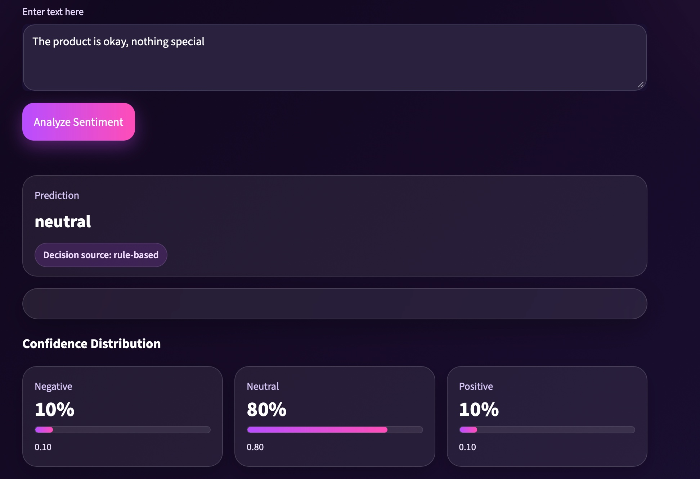
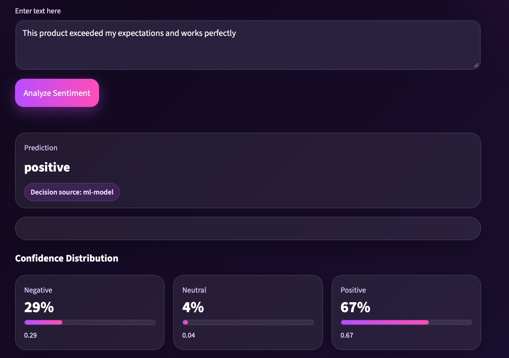
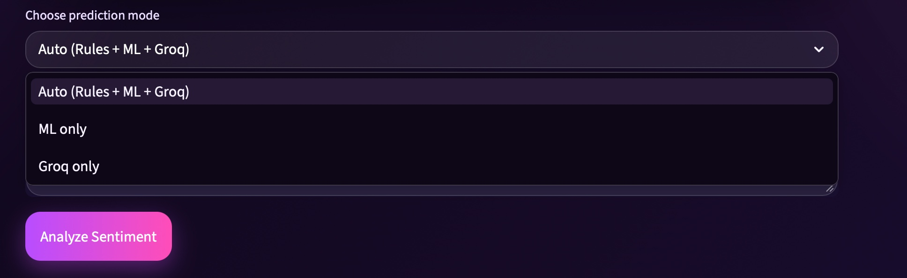

## Overview

This project is a practical sentiment analysis system that combines traditional machine learning with rule-based logic and LLM fallback.

The application classifies text into **positive, neutral, or negative** sentiment using a hybrid pipeline designed to improve robustness in low-data scenarios.

Unlike standard ML-only approaches, this system introduces:
- A rule-based layer for better neutral detection.
- Multiple prediction modes (ML / LLM / Hybrid).
- A fallback mechanism using Groq LLM when model confidence is low.

The project also includes an interactive **Streamlit dashboard** for real-time testing and experimentation.


# Sentiment Analyzer

A practical sentiment analysis project built as part of a hands-on AI engineering learning journey.  
This application classifies text into **positive**, **neutral**, or **negative** sentiment using a hybrid workflow that combines:

- **text preprocessing**
- **TF-IDF feature extraction**
- **traditional machine learning models**
- **rule-based neutral detection**
- **Groq fallback prediction**

The project also includes a **Streamlit dashboard** for interactive testing and visualization.

---

## Features

- Clean and preprocess raw text input
- Convert text into numerical features using **TF-IDF**
- Predict sentiment using trained machine learning models
- Improve neutral classification with a lightweight **rule-based layer**
- Support **Groq fallback** when confidence is weak or when selected manually
- Test multiple prediction modes from the dashboard
- Experimented with multiple classical ML models (Logistic Regression, SVM, Naive Bayes) and evaluated their performance

---

## How It Works

### 1. Text Preprocessing
The input text is cleaned through:

- lowercasing
- removing punctuation
- removing stopwords

### 2. Feature Extraction
The cleaned text is transformed into numerical features using **TF-IDF vectorization**.

### 3. Machine Learning Prediction
A trained classifier predicts sentiment based on the extracted features.

### 4. Rule-Based Neutral Detection
A lightweight rule-based layer detects neutral phrases such as:

- `okay`
- `nothing special`
- `average`
- `as expected`

This helps improve neutral handling when the training data is limited.

### 5. Groq Fallback
If the model confidence is weak, or if a different mode is selected, the system can call **Groq** for sentiment classification.

---

## Prediction Modes

The application supports three prediction modes:

### Auto (Rules + ML + Groq)
Uses rule-based logic first, then machine learning, then Groq fallback for uncertain cases.

### ML Only
Uses only the trained machine learning model.

### Groq Only
Uses the Groq LLM directly for prediction.

---

## Models Tested

During development, multiple machine learning models were explored:

- Logistic Regression
- LinearSVC
- MultinomialNB

This helped compare how different classifiers behave on sentiment analysis tasks.

---

## Project Structure

```bash
sentiment-analyzer/
│
├── .streamlit/
│ └── config.toml
│
├── app/
│ ├── data_loader.py # load and prepare datasets
│ ├── preprocess.py # text preprocessing (cleaning, stopwords, etc.)
│ ├── train.py # model training logic
│ ├── evaluate.py # model evaluation
│ ├── predict.py # prediction functions
│ ├── inference.py # inference pipeline
│ ├── groq_helper.py # Groq API integration
│ ├── load_imdb.py # IMDB dataset loader
│ ├── main.py # main script (optional CLI execution)
│ └── streamlit_app.py # Streamlit dashboard UI
│
├── data/ # datasets used for training/testing
├── models/ # saved trained models
├── screenshots/ # application screenshots
│ ├── 01-home.png
│ ├── 02-negative-result.png
│ ├── 03-neutral-result.png
│ ├── 04-positive-result.png
│ └── 05-prediction-models.png
│
├── requirements.txt
└── README.md


```

## Screenshots

### Home Interface


### Negative Prediction


### Neutral Prediction


### Positive Prediction


### Prediction Modes



## Installation

```bash
git clone https://github.com/yourusername/sentiment-analyzer.git
cd sentiment-analyzer
pip install -r requirements.txt

```

### 2. Run the App
```markdown
## Run the Application

```bash
streamlit run app/streamlit_app.py

```

### 2. Create a virtual environment
python -m venv .venv

### 3. Activate the virtual environment

#### Windows
.venv\Scripts\activate

#### Mac / Linux
source .venv/bin/activate

### 4. Install dependencies
pip install -r requirements.txt

# Environment Variables
#### To enable Groq integration, set your API key.

#### Mac / Linux
export GROQ_API_KEY="your_key_here"

#### Windows
set GROQ_API_KEY=your_key_here

# Run the Project

#### Train the model
python app/train.py

#### Evaluate the model
python app/evaluate.py

#### Run CLI prediction
python app/predict.py

#### Launch the Streamlit dashboard
streamlit run app/streamlit_app.py

### Example Inputs

#### Positive
This product exceeded my expectations and works perfectly

#### Neutral
The product is okay, nothing special

#### Negative
I regret buying this, it is a complete waste of money

## Limitations
- Neutral sentiment handling is partially rule-based

- The dataset is still limited compared to production-scale systems

- Traditional ML models may struggle with subtle sentiment

- Groq fallback depends on API availability

## Future Improvements
- Use larger and more balanced datasets
- Add transformer-based models
- Improve neutral detection
- Deploy the app online
- Add batch prediction support
- Add logging and analytics
- Add prediction history inside the dashboard


## Learning Outcomes
#### This project demonstrates practical work in:

- NLP preprocessing
- Text vectorization
- Machine learning classification
- Model comparison and evaluation
- Hybrid AI workflow design
- Streamlit dashboard development
- LLM integration into ML pipelines


## Author
### Ruqaya Suleyman

- AI Engineer, building practical NLP and LLM-based applications as part of a hands-on learning journey.